# Data Model

> Schema is managed by **Flyway** migrations `V1 → V22` (see
> `backend/pedidos/src/main/resources/db/migration`). JPA is configured with
> `ddl-auto=validate`, so the database is the source of truth and the schema
> must always match the entities.

---

## Entity relationships (overview)

The diagram below shows the entities and their relationships at a glance. Each
relationship line reads as **one-to-many**: the parent entity (`||--o{`) holds
the foreign key that points back to one row of the parent; the cardinality is
`1` on the parent side and `0..n` on the child side. The label on each line
describes the role of the foreign key (for example `PEDIDO` → `USUARIO` as the
*vendedor*). A nullable relation (e.g. `pedido` on `cobranza`) is drawn the
same way — nullability is a per-column detail captured in the tables below.
Entity column lists are abbreviated here; the full columns live in the
["Tables by migration"](#tables-by-migration) section.

```mermaid
erDiagram
    USUARIO ||--o{ USUARIO_ROLES : "tiene roles"
    USUARIO ||--o{ PEDIDO : "vendedor"
    USUARIO ||--o{ RUTA : "repartidor"
    ZONA ||--o{ CLIENTE : "agrupa"
    CLIENTE ||--o{ PEDIDO : "hace pedidos"
    CLIENTE ||--o{ COBRANZA : "recibe cobranzas"
    CLIENTE ||--o{ REMITO : "recibe remitos"
    CATEGORIA ||--o{ ITEM : "clasifica"
    ITEM ||--o{ LOTE : "tiene lotes"
    ITEM ||--o{ MOVIMIENTO_STOCK : "genera movimientos"
    ITEM ||--o{ PEDIDO_ITEM : "se pide"
    ITEM ||--o{ ORDEN_COMPRA_LINEA : "se compra"
    ITEM ||--o{ REMITO_LINEA : "se entrega"
    ITEM ||--o{ SUSTITUCION : "original/sustituto"
    ITEM ||--o{ PROVEEDOR_ITEM : "es provisto por"
    PROVEEDOR ||--o{ ORDEN_COMPRA : "emite compras"
    PROVEEDOR ||--o{ LOTE : "provee"
    PROVEEDOR ||--o{ PROVEEDOR_ITEM : "provee items"
    PEDIDO ||--o{ PEDIDO_ITEM : "contiene"
    PEDIDO ||--o{ MOVIMIENTO_STOCK : "genera"
    PEDIDO ||--o{ RUTA_PEDIDO : "se asigna"
    PEDIDO ||--o{ REMITO : "genera"
    PEDIDO ||--o{ COBRANZA : "cobra (nullable)"
    PEDIDO ||--o{ SUSTITUCION : "sustituye"
    PEDIDO ||--o{ PEDIDO : "pedido_padre"
    RUTA ||--o{ RUTA_PEDIDO : "incluye"
    ORDEN_COMPRA ||--o{ ORDEN_COMPRA_LINEA : "detalla"
    REMITO ||--o{ REMITO_LINEA : "detalla"
    NOTIFICACION }o--|| USUARIO : "para_usuario"

    USUARIO {
        bigint id PK
        varchar nombre
        varchar email UK
        varchar password_hash
        boolean activo
    }
    USUARIO_ROLES {
        bigint usuario_id FK
        varchar rol
    }
    ZONA {
        bigint id PK
        varchar nombre UK
        boolean activo
    }
    CLIENTE {
        bigint id PK
        varchar razon_social
        varchar cuit UK
        bigint zona_id FK
        boolean activo
    }
    CATEGORIA {
        bigint id PK
        varchar nombre UK
        boolean activo
    }
    ITEM {
        bigint id PK
        varchar sku UK
        varchar nombre
        varchar unidad_medida
        bigint categoria_id FK
        numeric precio_lista
        numeric stock_minimo
        boolean activo
    }
    PROVEEDOR {
        bigint id PK
        varchar razon_social
        varchar cuit UK
        boolean activo
    }
    PROVEEDOR_ITEM {
        bigint proveedor_id PK, FK
        bigint item_id PK, FK
        boolean activo
    }
    PEDIDO {
        bigint id PK
        varchar numero UK
        bigint cliente_id FK
        bigint vendedor_id FK
        bigint pedido_padre_id FK
        varchar estado
        date fecha_creacion
        boolean express
        numeric total
    }
    PEDIDO_ITEM {
        bigint id PK
        bigint pedido_id FK
        bigint item_id FK
        numeric cantidad_pedida
        numeric precio_unitario
    }
    MOVIMIENTO_STOCK {
        bigint id PK
        varchar tipo
        bigint item_id FK
        bigint lote_id FK
        bigint pedido_id FK
        numeric cantidad
        date fecha
    }
    RUTA {
        bigint id PK
        bigint zona_id FK
        bigint repartidor_id FK
        date fecha_jornada
        varchar estado
    }
    RUTA_PEDIDO {
        bigint ruta_id FK
        bigint pedido_id FK
    }
    ORDEN_COMPRA {
        bigint id PK
        varchar numero UK
        bigint proveedor_id FK
        date fecha
        varchar estado
    }
    ORDEN_COMPRA_LINEA {
        bigint id PK
        bigint orden_compra_id FK
        bigint item_id FK
        numeric cantidad_pedida
    }
    LOTE {
        bigint id PK
        bigint item_id FK
        bigint proveedor_id FK
        varchar codigo_lote
        date fecha_ingreso
        date fecha_vencimiento
        numeric cantidad_ingresada
        numeric precio_unitario
        varchar estado
    }
    REMITO {
        bigint id PK
        varchar numero UK
        bigint pedido_id FK
        bigint cliente_id FK
        date fecha_emision
        numeric monto_total
    }
    REMITO_LINEA {
        bigint id PK
        bigint remito_id FK
        bigint item_id FK
        numeric cantidad
        numeric precio_unitario
    }
    COBRANZA {
        bigint id PK
        bigint cliente_id FK
        bigint pedido_id FK
        numeric monto
        varchar forma_pago
        date fecha
    }
    SUSTITUCION {
        bigint id PK
        bigint pedido_id FK
        bigint item_original_id FK
        bigint item_sustituto_id FK
        numeric cantidad
        date fecha
    }
    NOTIFICACION {
        bigint id PK
        bigint para_usuario_id FK
        bigint pedido_id FK
        varchar tipo
        varchar mensaje
        boolean leida
        date fecha
    }
```



---

## Tables by migration

### V1 — `zona`
| Column | Type / Notes |
|---|---|
| `id` | PK |
| `nombre` | UNIQUE |
| `activo` | soft-delete flag |

### V2 — `usuario` + `usuario_roles`
| Table | Columns |
|---|---|
| `usuario` | `id`, `nombre`, `email` (UNIQUE), `password_hash`, `activo` |
| `usuario_roles` | `usuario_id` (FK CASCADE), `rol` — composite |

### V3 — `cliente`
`razon_social`, `cuit` (UNIQUE), `email`, `telefono`, `domicilio`,
`zona_id` (FK), `activo`.

### V4 — `item`, `lote`, `movimiento_stock`
| Table | Columns |
|---|---|
| `item` | `sku` (UNIQUE), `nombre`, `unidad_medida`, `activo` |
| `lote` | `item_id` (FK), `codigo_lote`, `fecha_ingreso`, `fecha_vencimiento`, `cantidad_ingresada` |
| `movimiento_stock` | `tipo`, `item_id` (FK), `lote_id` (FK, nullable), `pedido_id`, `cantidad`, `fecha`, `motivo` |

### V5 — `pedido`, `pedido_item`
| Table | Columns |
|---|---|
| `pedido` | `numero` (UNIQUE), `cliente_id` (FK), `vendedor_id` (FK), `pedido_padre_id` (FK self), `estado`, `fecha_creacion`, `fecha_jornada`, `observaciones`, `total` |
| `pedido_item` | `pedido_id` (FK CASCADE), `item_id` (FK), `cantidad_pedida`, `cantidad_reservada`, `cantidad_entregada`, `precio_unitario`, `pendiente_stock` |

### V6 — `ruta`, `ruta_pedido`
| Table | Columns |
|---|---|
| `ruta` | `zona_id` (FK), `repartidor_id` (FK), `fecha_jornada`, `estado` |
| `ruta_pedido` | `ruta_id` (FK CASCADE), `pedido_id` (FK), UNIQUE(`ruta_id`,`pedido_id`) |

### V7 — `seguridad`
Enables `pgcrypto` extension and seeds BCrypt password hashes.

### V8 — `item.stock_minimo`
Adds `stock_minimo` to `item` (used for low-stock alerts).

### V9 — `remito`, `remito_linea`, `cobranza`
| Table | Columns |
|---|---|
| `remito` | `numero` (UNIQUE), `pedido_id` (FK), `cliente_id` (FK), `fecha_emision`, `monto_total` |
| `remito_linea` | `remito_id` (FK CASCADE), `item_id` (FK), `cantidad`, `precio_unitario`, `subtotal` |
| `cobranza` | `cliente_id` (FK), `pedido_id` (FK, nullable), `monto`, `forma_pago`, `fecha`, `observaciones` |

### V10 — `proveedor`, `orden_compra`, `orden_compra_linea`
| Table | Columns |
|---|---|
| `proveedor` | `razon_social`, `cuit` (UNIQUE), `email`, `telefono`, `activo` |
| `orden_compra` | `numero` (UNIQUE), `proveedor_id` (FK), `fecha`, `estado`, `observaciones` |
| `orden_compra_linea` | `orden_compra_id` (FK CASCADE), `item_id` (FK), `cantidad_pedida`, `cantidad_recibida`, `precio_unitario` |

### V11 — `item.precio_lista`
Adds list price to `item`.

### V13 — `ruta.capacidad_bultos`
Adds capacity (in crates/bulk units) to a route.

### V14 — `notificacion`
`tipo`, `mensaje`, `para_usuario_id` (FK), `pedido_id` (nullable), `leida`, `fecha`.

### V15 — `sustitucion`
`pedido_id` (FK), `item_original_id` (FK), `item_sustituto_id` (FK), `cantidad`, `diferencia_precio`, `fecha`, `observaciones`.

### V16 — `pedido.express`
Adds `express BOOLEAN DEFAULT FALSE` to `pedido` plus index
`(estado, express DESC, fecha_creacion ASC)` to prioritize express orders in the
preparation/dispatch queue.

### V17 — `categoria`
Creates `categoria` (`id`, `nombre` UNIQUE, `activo`, `fecha_creacion`), adds
`item.categoria_id` (FK), backfills it from the legacy free-text
`item.categoria` column, then `DROP COLUMN categoria`. **Clean cut — no legacy
text category remains.**

### V18 — `lote.proveedor_id`
Adds nullable `proveedor_id` (FK) to `lote` plus index (lot provenance).

### V19 — `lote.estado`
Adds `estado VARCHAR(20) DEFAULT 'VIGENTE'` with
`CHECK (estado IN ('VIGENTE','AGOTADO','VENCIDO','DESCARTADO'))`.

### V20 — merma con signo negativo
Desde este cambio las mermas se persisten con **signo negativo** (coherente con
`EGRESO_VENTA`) y el disponible se calcula sumando algebraicamente. La migración
normaliza las mermas históricas guardadas con signo positivo:
`UPDATE movimiento_stock SET cantidad = -cantidad WHERE tipo = 'MERMA' AND cantidad > 0`.

### V21 — `proveedor_item` (catálogo de provisión)
Crea `proveedor_item` con **PK compuesta** `(proveedor_id, item_id)` y `activo`
(default TRUE, permite desvincular sin borrar historial). Índice
`idx_proveedor_item_item ON (item_id)` para consultas inversas. Backfill: los
items que un proveedor ya recibió en un lote lo proveen de facto (protege la
validación de OC para datos preexistentes).

### V22 — precio real en `lote` y OC sin precio
La OC ya **no** lleva precio en sus líneas: `DROP COLUMN precio_unitario` en
`orden_compra_linea`. El precio real se captura en la recepción de OC
(obligatorio) y en el ingreso manual de stock (opcional), persistiéndose en
`lote.precio_unitario` (`DECIMAL(18,4)`, nullable).

---

## Enums

| Enum | Values |
|---|---|
| `EstadoPedido` | `PENDIENTE_CONFIRMACION`, `PENDIENTE_STOCK`, `PENDIENTE_PREPARACION`, `PENDIENTE_ENTREGA`, `EN_VIAJE`, `ENTREGADO`, `ENTREGADO_PARCIAL`, `RE_AGENDADO`, `RECHAZADO` |
| `EstadoRuta` | `PLANIFICADA`, `EN_CURSO`, `FINALIZADA` |
| `LoteEstado` | `VIGENTE`, `AGOTADO`, `VENCIDO`, `DESCARTADO` |
| `Rol` | `VENDEDOR`, `ENCARGADO_DEPOSITO`, `REPARTIDOR`, `ADMINISTRATIVO` |
| `TipoMovimiento` | `INGRESO`, `RESERVA_PEDIDO`, `LIBERACION_RESERVA`, `EGRESO_VENTA`, `MERMA`, `AJUSTE_INVENTARIO` |
| `FormaPago` | `EFECTIVO`, `TRANSFERENCIA`, `TARJETA`, `OTRO` |
| `EstadoOrdenCompra` | `PENDIENTE`, `RECIBIDA_PARCIAL`, `RECIBIDA`, `CANCELADA` |

---

## Lifecycle: order (`pedido`)

```
crear           → PENDIENTE_CONFIRMACION
confirmar       → PENDIENTE_PREPARACION  (or PENDIENTE_STOCK if any item lacks stock)
despachar       → PENDIENTE_ENTREGA
iniciarViaje    → EN_VIAJE
registrarEntrega→ ENTREGADO or ENTREGADO_PARCIAL (generates child order with remainder)
reAgendar       → RE_AGENDADO
rechazar        → RECHAZADO  (releases stock reservations)
consolidar      → new PENDIENTE_CONFIRMACION order + sources become RECHAZADO
TTL job (48h)   → auto-cancels inactive orders
```

States eligible for collection (`cobranza`): `EN_VIAJE`, `ENTREGADO`,
`ENTREGADO_PARCIAL`.

## Lifecycle: lot (`lote`)

```
born            → VIGENTE
egreso agota    → AGOTADO   (no remaining quantity)
descartar       → DESCARTADO (books remaining stock as merma)
VENCIDO         → derived at read time (excluded from FEFO selection)
```

---

## Soft-delete

Soft-delete uses an `activo` boolean flag on `zona`, `usuario`, `cliente`,
`item`, `proveedor` and `categoria`. Business rules enforce it:

| Entity inactive | Effect |
|---|---|
| `item` | No stock operations; cannot be added to orders → `ITEM_INACTIVO` |
| `cliente` | Cannot receive new orders → `CLIENTE_INACTIVO` |
| `proveedor` | Purchase orders blocked → `PROVEEDOR_INACTIVO` |
| `usuario` | Cannot authenticate → `AUTH_INACTIVO` |

---

Continue to the [API reference](./03-api.md) or the [flows](./04-flujos.md).
